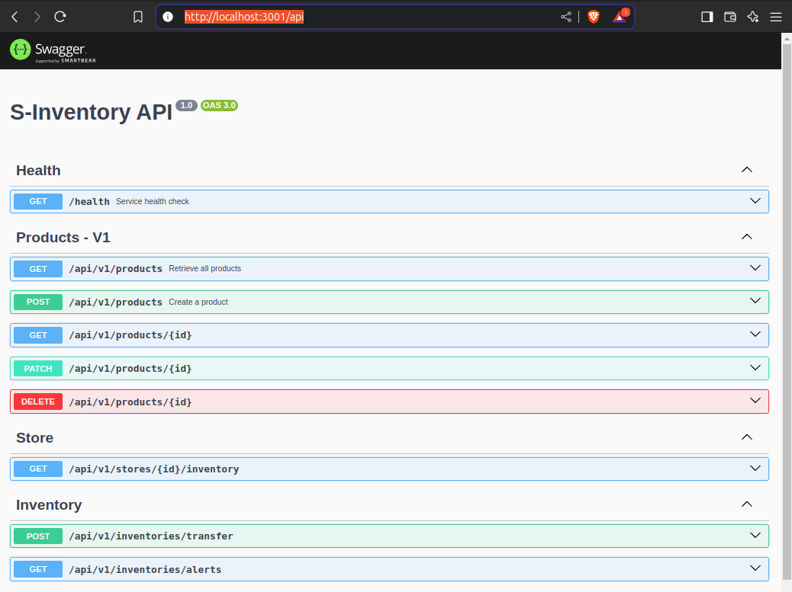

<p align="center">
  <a href="http://nestjs.com/" target="blank"></a>
  <a href="https://swagger.io/" target="blank"></a>
  <a href="https://www.postgresql.org/" target="blank"></a>
  <a href="https://www.docker.com/" target="blank"></a>
  <a href="https://cloud.google.com/?hl=es" target="blank"></a>
  <a href="https://cloud.google.com/kubernetes-engine?hl=es-419" target="blank"></a>

</p>

### Api publica expuesta en `http://34.111.107.44/api`

# S-Inventory - Technical test

Este proyecto implementa una API REST para la gestión correcta del inventario de una cadena de tiendas minoristas, permitiendo el control y monitoreo de productos.

## Arquitectura

El sistema ha sido diseñado siguiendo principios de arquitectura hexagonal combinados con el patrón CQRS (Command Query Responsibility Segregation), lo que proporciona varias ventajas importantes:

- **Independencia del dominio:** El núcleo de la aplicación está aislado de los detalles de implementación.
- **Separación de responsabilidades:** Clara división entre las operaciones de lectura y escritura.
- **Escalabilidad:** Posibilidad de utilizar diferentes bases de datos para operaciones de escritura (máster) y lectura (réplicas).

### Modelo de datos


### Decisiones de diseño

En esta solución, intencionalmente no se ha establecido una relación de clave foránea (FK) con la tabla "Stores". De hecho, esta tabla **no existe** en el diagrama por una razón específica:

> La implementación simula un escenario empresarial real donde las grandes corporaciones no exponen directamente su base de datos central. En lugar de eso, proporcionan acceso a través de APIs externas que se identifican mediante el ID de la tienda.

**Esta decisión arquitectónica permite:**

- [x] Mayor independencia entre sistemas
- [x] Integración con sistemas legacy sin modificaciones invasivas
- [x] Robustez ante cambios en sistemas externos

## Tecnologías utilizadas

- **Framework:** NestJS
- **Base de datos:** Postgresl con TypeORM
- **Documentación API:** Swagger

## Development pasos

```bash
# Clonar el proyecto
git clone git@github.com:iam-oov/technical-test-inventory.git
cd technical-test-inventory

# Configuración del entorno
cp .env.example .env
# Editar archivo .env con las credenciales necesarias y quitando las secciones que no son necesarias

# Ejecución del proyecto
docker compose up --build -d

# Aplicar migraciones a la BD
docker compose exec s-inventory npm run m:run

# Ejecución del endpoint health para validar el correcto funcionamiento
http://localhost:3001
```

## (Opcional) Configuración de Migraciones

En entornos de desarrollo y producción, la opción `synchronize` se ha configurado en `false`. Esto requiere que los desarrolladores gestionen las migraciones manualmente.

A continuación, se proporcionan tres comandos para facilitar la gestión de migraciones. Ten presente que necesitaras modificar el archivo `data-source.ts` con las credenciales de la base de datos que deseas aplicar las migraciones.

```bash
npm run m:generate   # Genera una nueva migración basada en los cambios realizados en las entidades
npm run m:run        # Ejecuta las migraciones pendientes
npm run m:revert     # Revierte la última migración aplicada
```

> [!IMPORTANT]
> Debe crearse una migración al iniciar el proyecto y cada vez que se modifique cualquier archivo `*.entity.ts` para persistir los cambios en la base de datos.

Asegúrate de ejecutar estos comandos según sea necesario para mantener la base de datos en sincronía con las entidades del proyecto.

## Documentación completa API

La documentación completa de la API está disponible en:

```bash
http://localhost:3001/api
```

> [!NOTE]
> Se ha priorizado la implementación y documentación detallada solo en los dos primeros endpoints de productos. El resto de endpoints siguen la misma estructura y convenciones por default, y pueden ser consultados en la documentación interactiva.



## Testing

> [!IMPORTANT]
> Ejecute todas las pruebas en entorno local (localhost) para evitar generar costos innecesarios y preservar los límites gratuitos de los servicios en la nube.

En esta sección describo las pruebas que he realizado para verificar el funcionamiento y rendimiento de la API.

### Test de integración

He utilizado Postman para probar todo el ciclo de vida de los productos y validar que la API funciona correctamente.

> [!IMPORTANT]
> La colección de Postman está disponible en la carpeta `public` del repositorio para que puedas replicar estas pruebas fácilmente.

### Enfoque de pruebas

Utilicé `Postman Collection Runner` para automatizar un flujo de pruebas completo en cuatro pasos:

1. **Crear un producto nuevo:** Hago un POST con datos aleatorios y guardo el ID que me devuelve la API.
2. **Verificar que se guardó correctamente:** Consulto el producto creado con GET /api/v1/products/:id y compruebo que:

- No hay errores (no recibo código 409)
- La estructura de los datos es correcta
- Los valores coinciden con los que envié

3. **Modificar el producto:** Guardo un nuevo nombre para el producto y hago un PATCH para actualizarlo.
4. **Verificar la actualización:** Vuelvo a consultar el producto y confirmo que el nombre se ha actualizado correctamente.


### Test de carga: JMeter y Postman

Configuración

- Base de datos con +30,000 registros dummy.
- Endpoints analizados: Elegí dos puntos críticos de la API:
  - Creación de productos (POST)
  - Listado de órdenes (GET)

Herramientas:

- **JMeter:** Para simular alta concurrencia
- **Postman:** Para validar respuestas y tiempos


## Production pasos

```bash
# Clonar el proyecto
git clone git@github.com:iam-oov/technical-test-inventory.git
cd technical-test-inventory

# Configuración del entorno
cp .env.example .env.prod
# Editar archivo .env.prod con las credenciales necesarias y quitando las secciones que no son necesarias

# Construcción de la imagen
docker compose -f docker-compose.prod.yml --env-file .env.prod build
```

## Infraestructura de Despliegue

### Pipeline de CI/CD

Un archivo de configuración personalizado `cloudbuild.yaml` define el proceso de construcción:

- Se activa automáticamente con los push a la rama `main`
- Construye imágenes Docker con un versionado consistente
- Publica las imágenes en `Google Cloud Artifact Registry`


### Despliegue en Kubernetes

La aplicación se despliega en un clúster de Google Kubernetes Engine (GKE):

- Infraestructura definida como código utilizando charts de Helm
- Orquestación automatizada de despliegue
- Arquitectura containerizada escalable
- Balanceo de carga y gestión de tráfico


### Arquitectura de Base de Datos

Los servicios de base de datos de producción son proporcionados por `NeonTech`:

- Base de datos PostgreSQL serverless
- Escalado automático y alta disponibilidad
- Mecanismos integrados de respaldo y recuperación


